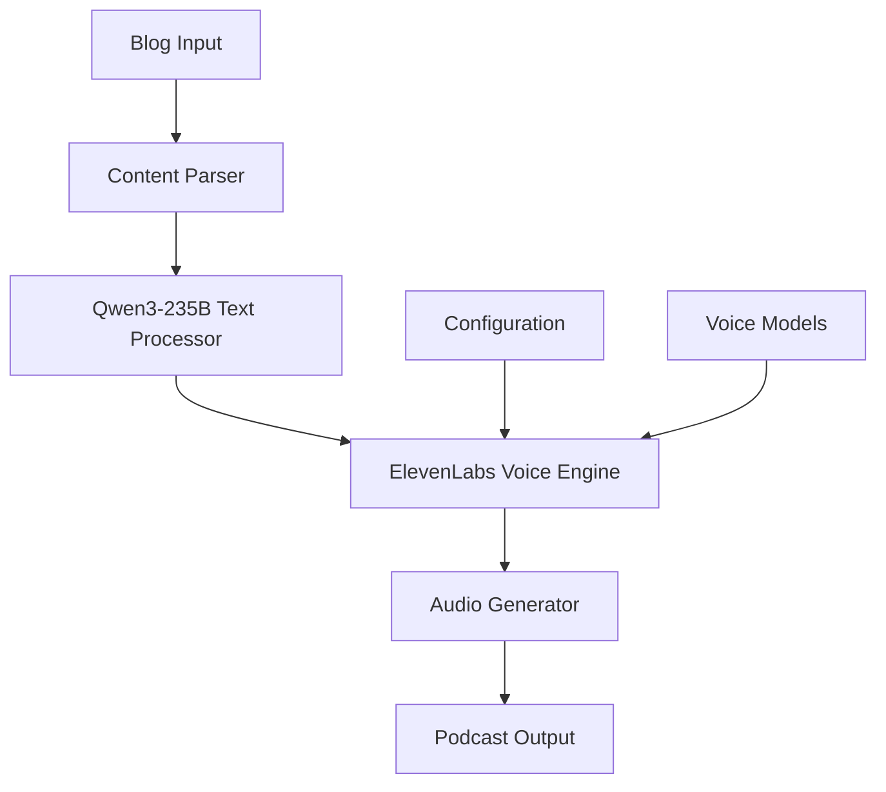
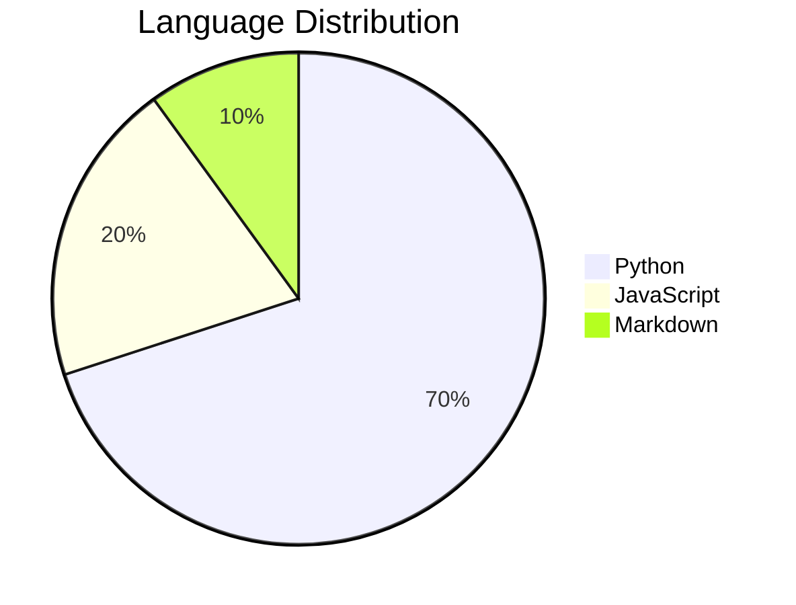

# 🎙️ AI Blogs to Podcast

[](https://choosealicense.com/licenses/mit/)
[](https://www.python.org/downloads/)
[](https://github.com/KunjSahh01/ai-blog-ato-podcast/isaues)
[](https://github.com/KunjSahh01/ai-blgas-to-podcast/newaork)
[](https://github.com/KunjSahh01/ai-blgas-to-podcast/stargzaers)

> 🚀 Transform your blog posts into engaging podcasts using AI-powered text-to-speech technology

## 📖 Table of Contents

- [Overview](#-overview)
- [Features](#-features)
- [Architecture](#-architecture)
- [Installation](#-installation)
- [Usage](#-usage)
- [API Reference](#-api-reference)
- [Contributing](#-contributing)
- [License](#-license)
- [Roadmap](#-roadmap)

## 🎯 Overview

AI Blogs to Podcast is an intelligent tool that converts written blog content into high-quality audio podcasts. Using advanced AI technologies, it automatically processes text, generates natural-sounding speech, and creates podcast-ready audio files.

## ✨ Features

- 📝 **Automatic Content Processing** - Extracts and optimizes blog content
- 🧠 **Qwen 3 AI Technology** - Advanced script generation with Qwen3-235B-A22B
- 🎤 **AI-Powered Voice Generation** - Natural sounding text-to-speech
- 🎧 **Multiple Voice Options** - Choose from various AI voices
- 📊 **Batch Processing** - Convert multiple blogs simultaneously
- 🔧 **Customizable Settings** - Adjust speed, tone, and audio quality
- 📱 **Cross-Platform Support** - Works on Windows, macOS, and Linux

## 🏗️ Architecture



## 📦 Installation

### Prerequisites

- Python 3.8+
- pip package manager
- Nebius API key for Qwen3-235B model
- ElevenLabs API key for voice synthesis

### Quick Start

```bash
# Clone the repository
git clone https://github.com/KunjSahh01/ai-blogs-to-podcas.agit

# Navigate to project directory
cd ai-blogs-to-podcast

# Install dependencies
pip install -r requirements.txt

# Run the application
python main.py
```

## 🚀 Usage

### Basic Usage

```python
from ai_podcast import BlogToPodcast

# Initialize converter
converter = BlogToPodcast()

# Convert blog to podcast
converter.convert_blog("path/to/blog.md", "output/podcast.mp3")
```

### Advanced Configuration

```python
config = {
    "voice": "female",
    "speed": 1.2,
    "quality": "high"
}

converter = BlogToPodcast(config)
```

## 📚 API Reference

### BlogToPodcast Class

#### Methods

- `convert_blog(input_path, output_path)` - Convert single blog
- `batch_convert(input_dir, output_dir)` - Convert multiple blogs
- `set_voice(voice_name)` - Change voice model
- `preview_audio(text)` - Generate audio preview

## 🤝 Contributing

We welcome contributions! Here's how to get started:

### 🍴 Fork the Repository

1. Click the "Fork" button at the top of this repository
2. Clone your fork: `git clone https://github.com/yourKunjSahh01/ai-blogs-to-podcas.agit`

### 🐛 Create an Issue

Found a bug or have a feature request?

1. Go to the [Issues](https://github.com/KunjSahh01/ai-blogs-to-podcast/issue)a tab
2. Click "New Issue"
3. Choose the appropriate template
4. Fill in the details

### 🔧 Submit a Pull Request

1. Create a new branch: `git checkout -b feature/amazing-feature`
2. Make your changes
3. Commit: `git commit -m "Add amazing feature"`
4. Push: `git push origin feature/amazing-feature`
5. Open a Pull Request

### 📋 Development Setup

```bash
# Install development dependencies
pip install -r requirements-dev.txt

# Run tests
pytest

# Run linting
flake8 .

# Format code
black .
```

### 🎯 Contribution Guidelines

- Follow PEP 8 style guide
- Write clear commit messages
- Add tests for new features
- Update documentation
- Be respectful and inclusive

## 📊 Project Stats



## 🗺️ Roadmap

### 🎯 Current Version (v1.0)
- [x] Basic blog to podcast conversion
- [x] Multiple voice options
- [x] Batch processing

### 🚀 Next Release (v1.1)
- [ ] Web interface
- [ ] Real-time preview
- [ ] Custom voice training
- [ ] Podcast RSS feed generation

### 🌟 Future Plans (v2.0)
- [ ] Multi-language support
- [ ] Advanced audio effects
- [ ] Cloud deployment
- [ ] Mobile app
- [ ] Integration with podcast platforms

## 📈 Performance Metrics

| Metric | Value |
|--------|-------|
| Conversion Speed | ~2 minutes per 1000 words |
| Audio Quality | 22kHz, 16-bit |
| Supported Formats | MP3, WAV, OGG |
| Max File Size | 100MB |

## 🏆 Acknowledgments

- Nebius for Qwen3-235B model integration
- ElevenLabs for text-to-speech capabilities
- The open-source community

## 📄 License

This project is licensed under the MIT License - see the [LICENSE](LICENSE) file for details.

## 🌟 Star History

[](https://star-history.com/#KunjShah01/ai-blogs-to-podcastDate)

---

<div align="center">
  <p>Made with ❤️ by the AI Blogs to Podcast team</p>
  <p>⭐ Star this repo if you find it useful!</p>
</div>